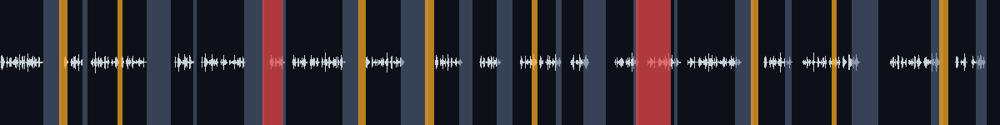
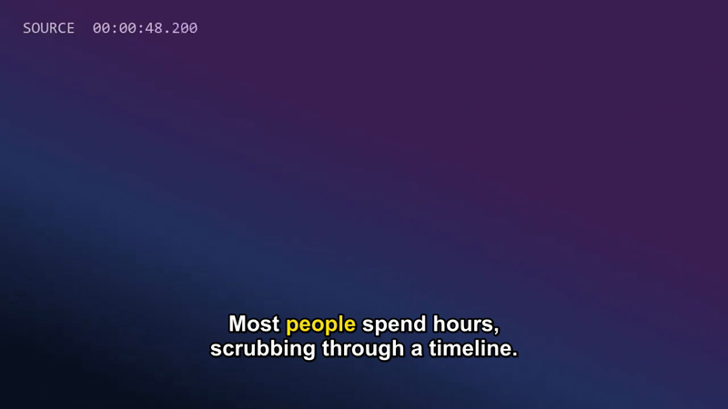

# takecut

Edit real video by editing its transcript. Agent Skills for Claude Code, Codex, Gemini CLI and Cursor
that cut silences, ums and bad takes, make face-tracked vertical shorts and burn styled captions,
using local transcription and tested scripts instead of improvised ffmpeg.

[](https://github.com/Abdalkaderdev/takecut/actions/workflows/ci.yml)
[](LICENSE)
[](https://agentskills.io)

- **Local and free by default.** faster-whisper on your GPU or CPU. No API key, no upload; footage
  never leaves the machine.
- **Correct cuts.** Frame-accurate, a 15 ms fade at every cut, audio and video lengths matched per
  piece, so sync holds across hundreds of cuts.
- **Shorts that follow the face.** 16:9 to 9:16 with a smoothed face-tracking crop, and the agent
  picks the moments.
- **Captions done properly.** Broadcast line/timing rules, five styles including word-highlight,
  and a translation flow that keeps the timings.
- **Tested ffmpeg recipes for everything else.** Compress to a size, GIF, speed, music ducking,
  PiP, watermark... every command in the reference runs in CI.
- **Installs anywhere skills do**: Claude Code plugin marketplace, or plain skill folders for
  Codex, Gemini CLI and Cursor.

## Demo

A raw take (synthetic speech with pauses, fillers and two flubbed sentences), cleaned by
`video-cleanup`. Blue = silence, amber = filler, red = retake:



| | raw take | after cleanup |
|---|---|---|
| duration | 1:33 | 0:59 |
| cut | | 19 silences, 8 fillers ("um", "uh"), 2 retakes, 21 cuts |
| re-transcribed output | 179 words | 158 words: 0 fillers, every sentence intact |

On real footage (a 3:09 public-domain White House address): 3:09 -> 2:34, 29 silences cut (20 s of
dead air at head and tail plus 27 pauses); re-transcribing the output gives 459 of 459 words.

Timing on a laptop with an RTX 5050: transcribing the 1:33 take took 5 s with `large-v3-turbo`
(38 s on CPU with `small`); transcribe + cleanup + preview + final render, 23 s end to end.

<table>
<tr>
<td></td>
<td></td>
</tr>
<tr>
<td><code>highlight</code> captions on the cleaned edit</td>
<td>9:16 short, <code>pop</code> captions</td>
</tr>
</table>

The demo clip is generated by `tests/synth.py` (espeak-ng voice), so there is no face to track
in it; face tracking was verified on a public-domain talking-head video, not included here.

### What a session looks like

Real run, Claude Code with the plugin, trimmed:

> **You:** talk.mp4 is a raw take. Clean it up (silences, ums, retakes), show me the preview, then
> render the final and make 2 vertical shorts with captions from the best moments.
>
> **Claude:** *(loads video-edit, probes, transcribes, loads video-cleanup)* Both retakes (s0006,
> s0014) are genuine false starts. Rendering preview.
>
> *(renders final, loads video-shorts, writes shorts.json, renders)*
>
> - Cleanup: 1:33 -> 0:59. I cut 19 silences, 8 ums/uhs and 2 retakes. I checked both retakes
>   against the transcript: they're the repeated "Then it cuts them out" and "A transcript turns
>   the whole video into text".
> - Preview: `edits/talk/cleanup.preview.mp4`
> - Final: `edits/talk/cleanup.mp4` (1280x720)
> - Shorts: 1080x1920, word-by-word captions, -14 LUFS:
>   - `edits/talk/shorts/01-edit-video-by-editing-text.mp4` (0:22)
>   - `edits/talk/shorts/02-stop-scrubbing-timelines.mp4` (0:26)

Other things to ask:

- "Remove the part where I talk about pricing and move the summary to the start."
- "Make 3 shorts from this podcast, 30-45 seconds, with hooks."
- "Burn yellow word-highlight captions into cleanup.mp4."
- "Make German subtitles for this video."
- "Compress this to under 25 MB for Discord." / "Turn seconds 4-9 into a GIF."

## How it works

```
 source.mp4 ──probe──> transcribe ──> transcript.txt ──> agent reads it
                         │             [s0012 00:01:03.420-00:01:07.900] ...
                         │
                         └─> cleanup.py ──┐        agent writes / edits
                                          v        v
                                     edit.edl.json  (keep/drop by segment id or time)
                                          │
                     render.py --preview ─┤─> edit.preview.mp4   (480p, seconds)
                     render.py ───────────┴─> edit.mp4 + edit.words.json (remapped transcript)
                                                         │
                         captions.py (SRT/VTT/ASS/burn) <┤
                         shorts.py (cut, 9:16 reframe, captions) <┘
```

The agent does what a model is good at: reading, judging, picking moments, translating. Scripts
do what must be exact: timestamps, frame-snapped cuts, fades, sync, loudness, crop paths. Details
in [docs/design.md](docs/design.md).

## Skills

| skill | does |
|---|---|
| [`video-edit`](skills/video-edit/SKILL.md) | probe, transcribe, EDL, preview and final render. The shared engine |
| [`video-cleanup`](skills/video-cleanup/SKILL.md) | silences, fillers (12 languages), retakes, stutters, EBU R128 loudness |
| [`video-shorts`](skills/video-shorts/SKILL.md) | moment picking, face-tracked 9:16 reframe, captions, batch export |
| [`video-captions`](skills/video-captions/SKILL.md) | SRT/VTT, styled ASS, burn-in, translation with original timings |
| [`video-ffmpeg`](skills/video-ffmpeg/SKILL.md) | tested recipes: trim, concat, speed, crop/pad, compress, GIF, ducking, PiP, watermark |

## Requirements

- **ffmpeg** with ffprobe on PATH (6.0+; libass for burned captions, present in standard builds).
  Windows `winget install Gyan.FFmpeg`, macOS `brew install ffmpeg`, Debian/Ubuntu `apt install ffmpeg`.
- **uv** ([install](https://docs.astral.sh/uv/getting-started/installation/)). Scripts declare their
  own dependencies (PEP 723); `uv run` installs them into its cache on first use and fetches
  Python 3.10+ if needed.
- Optional: NVIDIA GPU with a recent driver. CUDA libraries are fetched automatically (~1 GB once).
- Disk: Whisper models download on first use (`small` 0.5 GB, `large-v3-turbo` 1.6 GB).

## Install

All skills must sit side by side (`video-edit` holds the shared scripts).

**Claude Code (plugin):**

```
/plugin marketplace add Abdalkaderdev/takecut
/plugin install takecut@takecut
```

**Claude Code (plain skills):**

```bash
git clone https://github.com/Abdalkaderdev/takecut
cp -r takecut/skills/* ~/.claude/skills/
```

**Codex and Gemini CLI** (shared `~/.agents/skills`):

```bash
mkdir -p ~/.agents/skills && cp -r takecut/skills/* ~/.agents/skills/
```

**Gemini CLI** (alternatives):

```bash
cp -r takecut/skills/* ~/.gemini/skills/
# or, one skill at a time:
for s in video-edit video-cleanup video-shorts video-captions video-ffmpeg; do
  gemini skills install https://github.com/Abdalkaderdev/takecut.git --path skills/$s --scope user
done
```

**Cursor:**

```bash
mkdir -p ~/.cursor/skills && cp -r takecut/skills/* ~/.cursor/skills/
```

On Windows PowerShell use `Copy-Item -Recurse takecut\skills\* $HOME\.claude\skills\` (same for the
other folders).

## Usage

You normally just ask the agent. Each skill's `SKILL.md` shows the exact commands it runs; you can
run them yourself too (paths relative to the repo):

```bash
# video-edit
uv run skills/video-edit/scripts/probe.py talk.mp4
uv run skills/video-edit/scripts/transcribe.py talk.mp4            # -> edits/talk/transcript.txt
uv run skills/video-edit/scripts/render.py edits/talk/my.edl.json --preview
uv run skills/video-edit/scripts/render.py edits/talk/my.edl.json

# video-cleanup
uv run skills/video-cleanup/scripts/cleanup.py edits/talk/transcript.words.json
uv run skills/video-edit/scripts/render.py edits/talk/cleanup.edl.json

# video-captions
uv run skills/video-captions/scripts/captions.py srt edits/talk/cleanup.words.json
uv run skills/video-captions/scripts/captions.py ass edits/talk/cleanup.words.json --preset highlight --video edits/talk/cleanup.mp4
uv run skills/video-captions/scripts/captions.py burn edits/talk/cleanup.mp4 edits/talk/cleanup.highlight.ass

# video-shorts (shorts.json: [{"title": "...", "segs": "s0010-s0016"}, ...])
uv run skills/video-shorts/scripts/shorts.py talk.mp4 edits/talk/shorts.json --preset pop

# video-ffmpeg
uv run skills/video-ffmpeg/scripts/compress.py talk.mp4 --mb 25
uv run skills/video-ffmpeg/scripts/duck.py talk.mp4 music.mp3
```

A minimal EDL that drops two segments and a time range:

```json
{"sources": {"main": "../../talk.mp4"}, "transcripts": {"main": "transcript.words.json"},
 "drop": [{"segs": "s0004-s0005"}, {"start": "00:02:10.5", "end": 135.2}]}
```

Full schema: [skills/video-edit/references/edl.md](skills/video-edit/references/edl.md).

Outputs never overwrite sources. Everything lands in `edits/<name>/` next to the source video.

## Configuration

| what | how |
|---|---|
| Whisper model | `transcribe.py --model tiny\|base\|small\|medium\|large-v3\|large-v3-turbo` (default: turbo on GPU, small on CPU) |
| device | `--device auto\|cuda\|cpu`, `--compute-type float16\|int8\|...` |
| language | `--language de` (skips detection; also picks the filler prompt and list) |
| names, jargon | `--prompt "Kubernetes, Abdalkader, takecut"` |
| hosted API | `--api groq` with `GROQ_API_KEY` (whisper-large-v3-turbo) or `--api openai` with `OPENAI_API_KEY` (whisper-1). Uploads audio |
| fillers | `cleanup.py --add-fillers "basically,actually"`, `--fillers "um,uh"`, `--no-like` |
| silence | `--noise -30dB`, `--min-silence 1.0`, `--keep-pause 0.25` |
| loudness | `--lufs -14` (social) / `-16` (default) / `--no-loudnorm`; EDL `"loudnorm": true` |
| caption style | `captions.py ass --preset clean\|boxed\|minimal\|highlight\|pop --font "Inter"` |
| caption rules | `--max-chars 42 --max-lines 2 --max-cps 17 --min-dur 0.83 --max-dur 7` |
| reframe | `shorts.py --x 0.3` (fixed position), `--size 1080x1350`, `--no-captions` |
| model cache | Hugging Face cache (`HF_HOME`); face model in `~/.cache/takecut` (`TAKECUT_CACHE`) |

## FAQ and troubleshooting

**How is this different from [video-use](https://github.com/browser-use/video-use)?**
video-use (Browser Use) came first with the same core idea: give the agent a transcript instead of
frames. It's excellent and broader on the creative side: color grading, animation overlays
(HyperFrames, Remotion, Manim), visual self-checks of rendered cuts, speaker diarization and audio
events via ElevenLabs Scribe, session memory. It needs an ElevenLabs API key, so audio is uploaded
and billed. takecut transcribes locally by default (free, offline, private), and focuses on a
different set of jobs: automatic retake/stutter detection with a reviewable report, face-tracked
vertical shorts, caption presets with a translation flow, and a CI-tested ffmpeg recipe skill. It
ships as five small skills plus a Claude Code plugin. No code is shared between the projects. Use
whichever fits; they don't conflict.

**`ffmpeg not found`** - install it (see Requirements) and open a new terminal so PATH updates.

**CUDA errors / GPU not used** - with an NVIDIA GPU, `transcribe.py` fetches cuBLAS/cuDNN wheels
via uv on first run. If CUDA still fails it falls back to CPU and says why. Force CPU with
`--device cpu`. Old drivers: update to one supporting CUDA 12.

**Phone footage drifts out of sync** - phones record variable frame rate. `probe.py` warns about
it; convert to constant frame rate first (`ffmpeg -i in.mp4 -fps_mode cfr -r 30 ... out.mp4`, see
the EDL reference) and edit the converted copy.

**Long videos** - measured here, transcription runs at about 25x realtime on a laptop RTX 5050
(`large-v3-turbo`) and 2-3x on CPU (`small`): a 1 h recording is ~2-3 min on GPU, ~25 min on
CPU (`--model base` is faster, or use `--api groq`). The final 1080p render ran at ~4-5x realtime;
the 480p preview is much faster, so check it first. The API backend uploads 20-minute chunks.

**A word got clipped / a pause is too tight** - raise `--keep-pause`, or edit the EDL: every drop
has `reason` and `text`, delete the entries you disagree with and re-render.

**Fillers not detected** - Whisper drops "um" unless prompted; the prompt exists for en, de, fr,
es, it, pt, nl. For other languages silences and retakes still work, fillers may not.

**Captions use the wrong font** - libass falls back when the font isn't installed. Install it or
pass `burn --fonts-dir ./fonts`.

**Does the face tracking handle two people?** It follows the largest face and prefers continuity,
so it stays on one speaker until the other clearly dominates. It doesn't switch on who is talking
yet (see roadmap). Use `--x` for fixed framing.

## Roadmap

- Active-speaker reframing (audio-visual) for two-person podcasts
- Speaker diarization in the transcript
- B-roll and image overlays in the EDL
- Resumable transcription for multi-hour files
- Silence detection with an automatic noise floor

## Contributing

Issues and pull requests are welcome. Run the tests before sending a change:

```bash
uv run --no-project --with pytest python -m pytest -m "not e2e"   # unit, render, recipes (needs ffmpeg)
uv run --no-project --with pytest python -m pytest -m e2e         # needs espeak-ng, downloads Whisper base
```

Keep scripts single-file with PEP 723 headers, the shared engine standard-library only, and add a
test that fails without your change. New ffmpeg recipes go in
`skills/video-ffmpeg/references/recipes.md` as single-line commands; CI runs them.

## License

[MIT](LICENSE)

## Author

Abdalkader Alhamoud - [abdalkader.dev](https://abdalkader.dev) - [GitHub @Abdalkaderdev](https://github.com/Abdalkaderdev)
